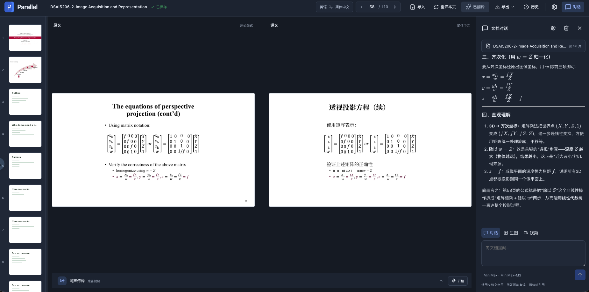

# Parallel

本地运行的文稿对照翻译工具，支持 macOS，自带模型密钥（BYOK）。



## 功能

- 导入 PDF、PPTX、PPT、HTML，逐页查看原件与译文，保留版式与公式。
- 支持单页重译、失败续译；历史按会话保存，导出时合并 PDF。
- 自选翻译服务、模型供应商和任务路由。
- 文档对话支持 Markdown 和 LaTeX，按配置使用图片、视频生成服务。
- 同传浮窗可拖动、缩放，逐句显示原文和译文，支持滚动回看。
- 文字、录音与文稿历史存于本地 SQLite，同传历史支持文字、录音及 ZIP 导出。

**录音与同声传译仍待实机调试。** 浏览器自带识别受网络影响，云端识别需配置对应服务；时间对齐为片段级别。复杂 PDF 的译文版式可能需要检查。

## 运行

需要 macOS、Node.js 22+、Python 3.11/3.12。PPT 转换需要 LibreOffice，辅助渲染使用 Poppler。

```bash
git clone https://github.com/qxryz/Parallel.git
cd Parallel
npm install
npm run setup:pdf
npm run dev
```

启动后在设置中填写自己的模型或翻译服务 Key，即可导入材料开始翻译。数据保存在本机；使用云服务时，相关文字或音频会发送到所选供应商。

构建：

```bash
npm run build
```

PDF 翻译使用 PDFMathTranslate；第三方来源与许可见 [THIRD_PARTY_NOTICES.md](THIRD_PARTY_NOTICES.md)。

## 一起完善

欢迎 [Star / Fork](https://github.com/qxryz/Parallel)，提交 Issue 或 Pull Request，一起增加新功能。
